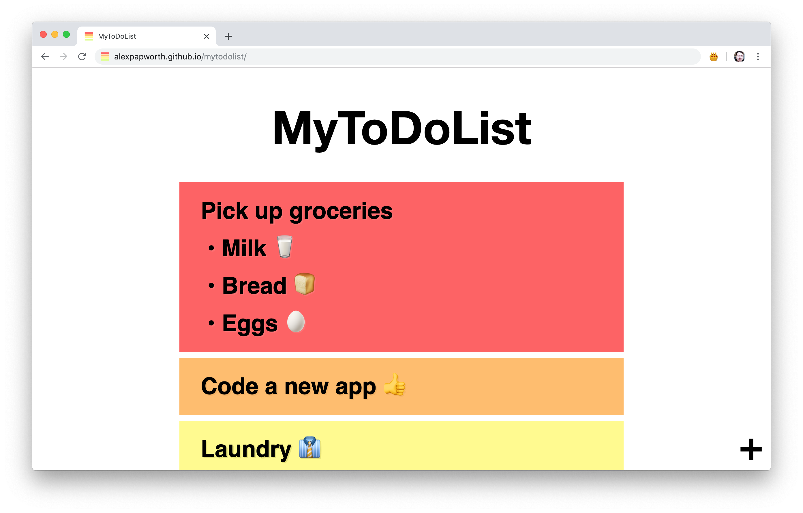
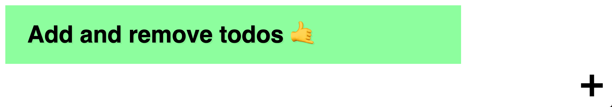
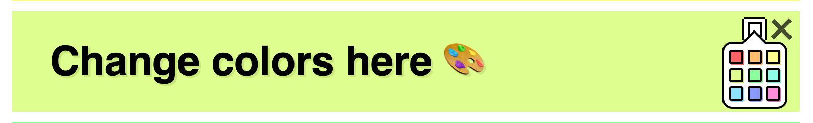

# MyToDoList

A simple HTML page for keeping track of things ya need ta do. Drag and drop is implemented with native Javascript 🤙

# Features

## Add or remove todos

The plus button in the bottom right will add a new todo. The cross button in the top right (of each todo) will delete that specific todo.

There isn't away to remove all your todos at once at this point, but you could always run `localStorage.clear()` in the console if you want.

## Change color

Hover on the palette to change the color of a todo. You'll see a temporary example when hovering on each color, but you'll need to click if you want to set it permamently.

## Persistent Data

The page uses the Javascript `localStorage` API to save data to your browser. This means you can refresh the page or quit the browser, and have your todos remain.

But if you clear your browser cache, then you'll lose the todos. 🤷‍♂️

# Demo

Test it out here. https://alexpapworth.github.io/mytodolist/

## License

This project is licensed under the MIT License - Feel free to do what you want with it!