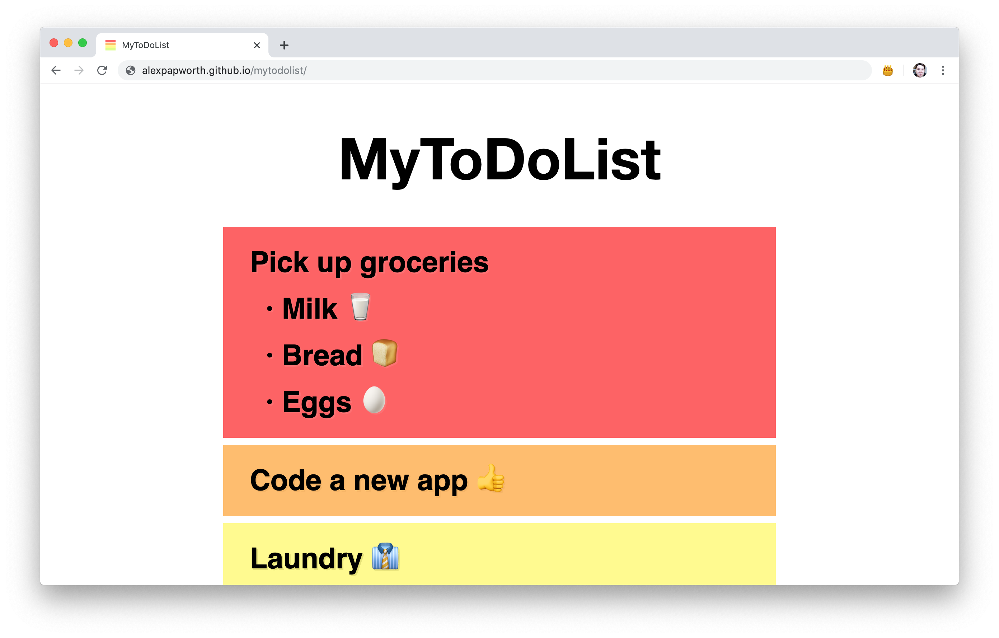

# MyToDoList

A simple HTML page for keeping track of things ya need ta do. Drag and drop is implemented with native Javascript 🤙

Test it out here. https://alexpapworth.github.io/mytodolist/

# Features

## Persistent Data

The page uses the Javascript `localStorage` API to save data to your browser. This means you can refresh the page or quit the browser, and have your todos remain.

But if you clear your browser cache, then you'll lose the todos. 🤷‍♂️

## License

This project is licensed under the MIT License - Feel free to do what you want with it!